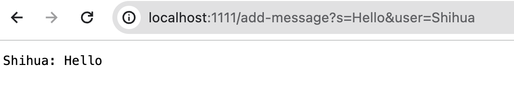

# ChatServer.java:

```
import java.io.BufferedWriter;
import java.io.FileWriter;
import java.io.IOException;
import java.io.PrintWriter;
import java.net.URI;
import java.nio.file.Files;
import java.nio.file.Paths;
import java.util.List;

class ChatHandler implements URLHandler {
    List<String> messages; //store message
    String path; // Path

    ChatHandler(String path) throws IOException {
        this.path = path;
        this.messages = Files.readAllLines(Paths.get(path));
    }

    public String handleRequest(URI url) throws IOException {
        String query = url.getQuery();
        if (url.getPath().equals("/add-message")) {
            String[] params = query.split("&");
            if (params.length == 2 && params[0].startsWith("s=") && params[1].startsWith("user=")) {
                String message = params[0].substring(2);
                String user = params[1].substring(5);
                String addChat = user + ": " + message;
                this.messages.add(addChat);
                this.log(addChat);
                return String.join("\n", messages) + "\n";
            } else {
                return "Invalid input\n";
            }
        } else {
            return "Invalid path\n";
        }
    }

    void log(String s) {
        try (FileWriter fw = new FileWriter("session.log", true);
             BufferedWriter bw = new BufferedWriter(fw);
             PrintWriter out = new PrintWriter(bw)) {
            out.println(s);
        } catch (IOException e) {
            System.out.println("Error logging: " + e.getMessage());
        }
    }
}

class ChatServer {
    public static void main(String[] args) throws IOException {
        if (args.length != 2) {
            System.out.println("Usage: java ChatServer <port number> <file path>");
            return;
        }

        int port = Integer.parseInt(args[0]);
        Server.start(port, new ChatHandler(args[1]));
    }
}

```


